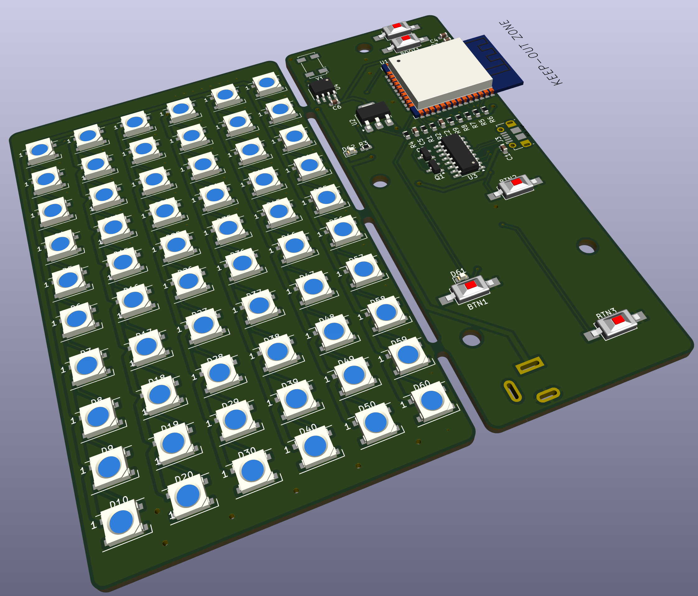
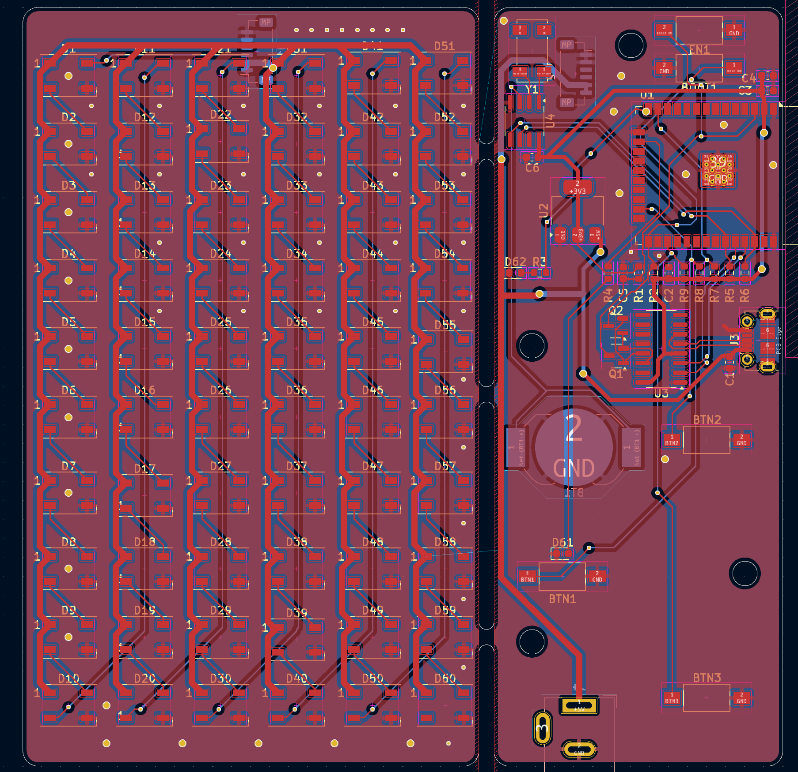
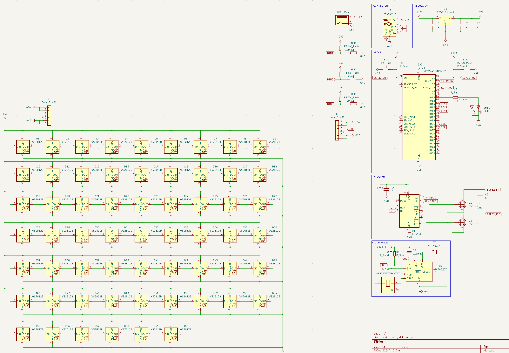

# Desktop Light

## desktop light with micro usb programming usb and extendable light

### features
* ESP32
* WS2812b
* RTC
* 3 programmable buttons
* CH310 usb programming
* Jack connector 5V

### 3d

### pcb

### schematic
